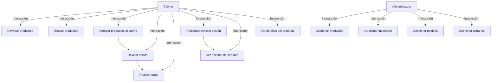

## Calculadora Electrica

Pasos
1. Usuario ingresa Voltaje, Corriente, FP, Tipo de circuito, Temperatura y numero de Hilos.
2. Calculadora calcula CALCULO DE LA CORRIENTE NOMINAL.
3. Con la Corriente Nominal se calcula CÁLCULO DEL INTERRUPTOR TERMOMAGNETICO.
4. Con corriente nominal y factores de ajuste se realiza la capacidad de conducción
5. Se caída de tensión
6. Se selecciona conductor 
7. Se Selecciona la canalizacion
8. Se da informacion completa obtenida 
9. Se realiza memoria de calculo

